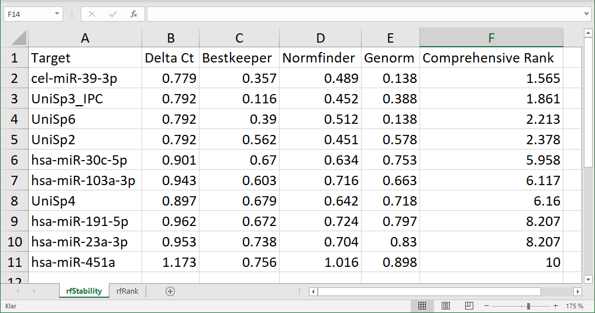
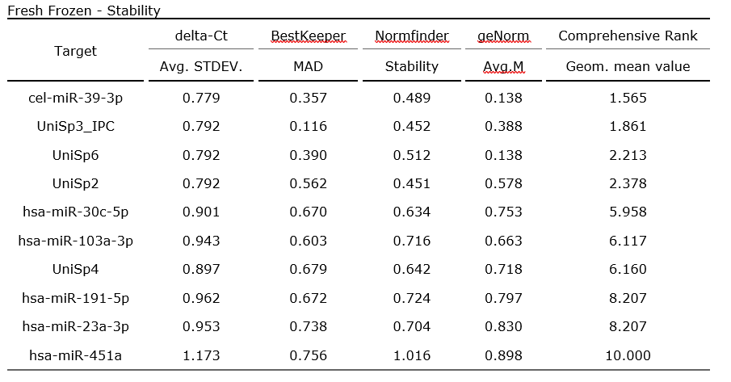
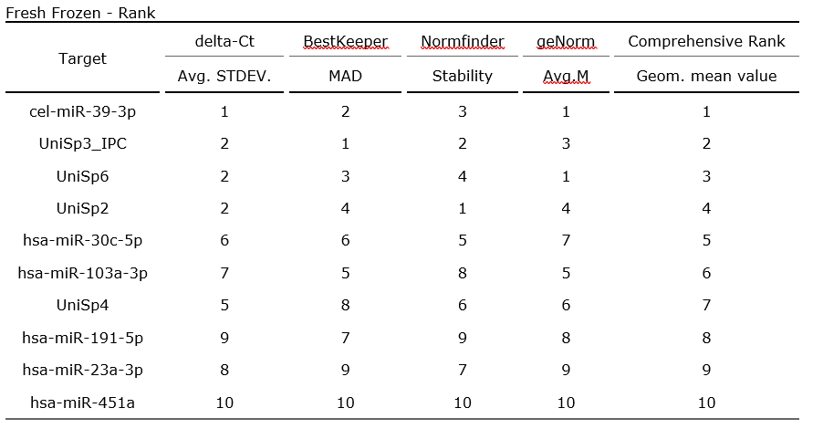
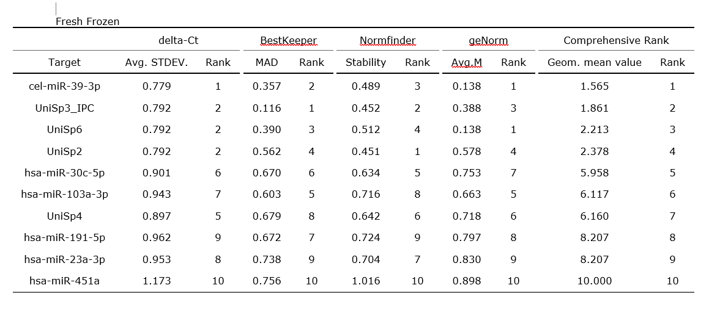

```{r, include = FALSE}
knitr::opts_chunk$set(
  collapse = TRUE,
  comment = "#>"
)
```

```{r setup}
library(RefSeeker)
```


The rs_exporttable is the simplest to use, it creates tabular output of
the analysis results.

The function require a "refseekerlist", this is the output from the
rs_reffinder function and is a list of lists containing stability values
and rank values from each algorithm. See the RefSeeker Intro vignette
for more info.

Lets import three sample data set contained in an xlsx file and create
some results.

```{R}
rs_data <- rs_loaddata("../inst/exdata/vignetteInputs/RefSeeker_data_test.xlsx")
rs_results <- rs_reffinder(rs_data)

rs_results
```

<br> As seen, three sets of results populate this list; Fresh Frozen,
FFPE and Plasma. Each set of results contain two tables; one with
stability values and one with stability rankings. <br>

## Export to spreadheets; xlsx or ods

To export to a xlsx or ods, A spreadsheet file will be created for each
data set. each of these files will contain two sheets, one for each
table.

```{R eval = FALSE}
rs_exporttable(rs_results, filename = "cohort1", tabletype = "xlsx", addDate = FALSE)
```

Note: Though tabletype = "xlsx" is the default option and do not need to
be explicitly selected it is still good practice to do so for
readability

<br> If an ods file is desired just replace the tabletype, the result
essentially will be the same.

```{R eval = FALSE}
rs_exporttable(rs_results, filename = "cohort1", tabletype = "ods")
```



<br> What is seen in this figure is the results from the Fresh Frozen
data set.

Note that for the xlsx files, the three file created will at the time of
writing be named:

cohort1_Fresh_Frozen.xlsx<br> cohort1_FFPE.xlsx<br>
cohort1_Plasma.xlsx<br>

## Export to text based file formats; csv, tsv or txt

The next group of table outputs available trough RefSeeker is the text
baased options. These are csv, tsv and txt files. csv stands for comma
separated values and is a light weight table written in a txt file. Each
line represents a row and column values are separated by commas.

The same is true for tsv but instead of commas, tsv uses tab-separated
values. And for the txt version spaces are used and values are
surrounded by double-quotes. These file types a simple, light and cross
compatible and are therefore good choices if data needs to be shared
between different programs or systems.

To export the results data to any of these file type set the tabletype
argument to a string representing the desired type:

```{R eval = FALSE}
rs_exporttable(rs_results, filename = "cohort1", tabletype = "csv")
rs_exporttable(rs_results, filename = "cohort1", tabletype = "tsv")
rs_exporttable(rs_results, filename = "cohort1", tabletype = "txt")
```

Two files for each data set will be created using any of these
selections. One for stability values and one for stability rankings.

## Export to docx

For publishing results a nice formatted table is needed, a few simple
table are available by using one of the "docx" tabletypes. There are
three; "docx-stability", "docx-rank" and "docx-combi".

As the choices might suggest, these print out a table for each data set
with either stability values, stability ranks or a combination of these.

```{R eval = FALSE}
rs_exporttable(rs_results, filename = "cohort1", tabletype = "docx-stability")
```



```{R eval = FALSE}
rs_exporttable(rs_results, filename = "./cohort1", tabletype = "docx-rank")
```



```{R eval = FALSE}
rs_exporttable(rs_results, filename = "cohort1", tabletype = "docx-combi")
```



<br>

<br> <br> <br> <br> <br>


