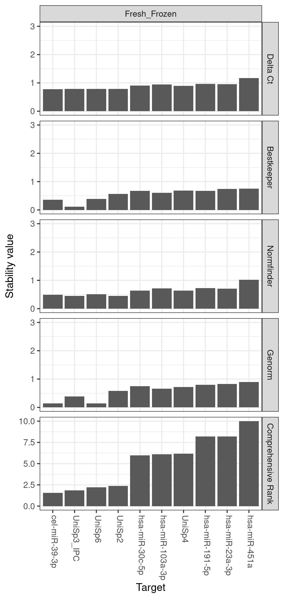
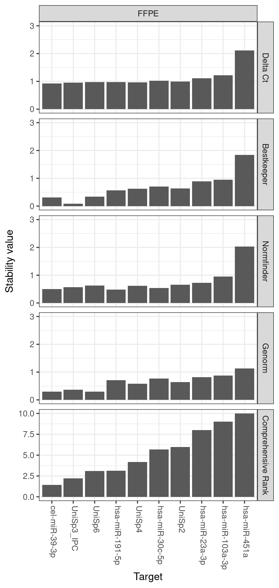
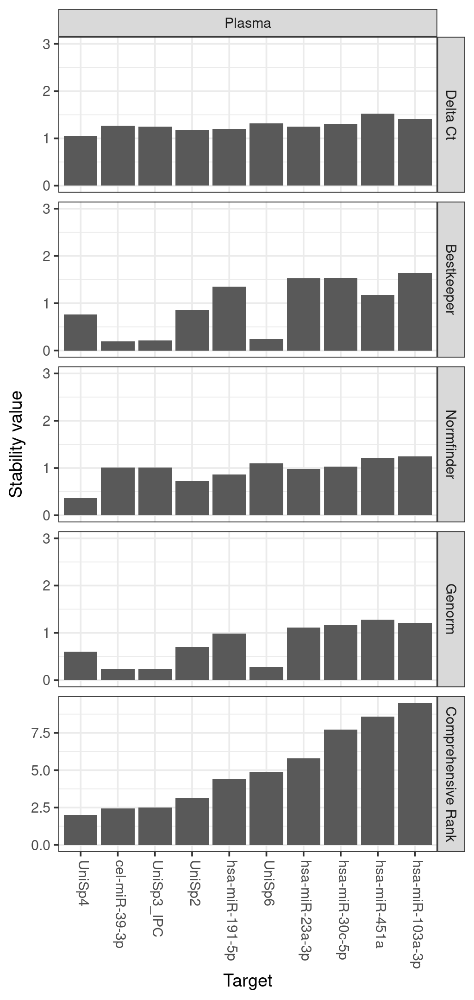

```{r, include = FALSE}
knitr::opts_chunk$set(
  collapse = TRUE,
  comment = "#>"
)
```


This vignette will show you how to prepare and import expression data into R using the refSeeker package.

Data can be imported from several different file types, however, some requirements and limitations will be discussed for each type of file.

Once data has been successfully loaded the stability analysis can be performed. Please refer to the <<INSERT NAME OF ANALYSIS VIGNETTE>> for further help with performing the stability analysis.

```{r setup}
library(refSeeker)
```

## Loading data from excel files

### Prepare Data

Before loading data from excel, the file first need to be prepared:

- Each sheet must contain only one data set

- Each column must be representing a gene/target and each row representing an individual sample.

- Each column must be named.

- Row names must be excluded

Note that missing data is discouraged since this has not been tested and verified


To load data from an excel file use rs_loadexceldata function.


```{r eval=FALSE}
exceldata <- rs_loadexceldata()
```

A dialog window will appear, allowing for selecting a file for processing.


Excel data can also be loaded via provided file path
```{r }
exceldata <- rs_loadexceldata("../inst/exdata/vignetteInputs/Reffinder_data_test.xlsx")

exceldata
```


The result returned from a successful loading of data is a list containing the data sets loaded from each sheet.

Each individual data set can be selected using the list index or name.

```{r eval=FALSE}
exceldata$Fresh_Frozen
```
or
```{r}
exceldata[[1]]
```

## Loading data from csv, tsv or txt files

# Prepare data

To prepare data for import using text file based files it is recommended to create a separate folder to hold the data files.

When loading data the load function will look for all the files of the same type in the folder containing the selected/provided file. This means that if a csv file is selected for import the function will try to import all csv files in that folder. This could lead to unwanted results if the wrong csv file is imported alongside the correct ones.


<br>
<br>
<br>
<br>
<br>
<br>
<br>
<br>
<br>
<br>
<br>
<br>


The data can now be analysed by each algorithm or reffinder

```{r}
rs_normfinder(exceldata$Fresh_Frozen)
```

```{r}
rs_genorm(exceldata$Fresh_Frozen)
```
```{r}
rs_bestKeeper(exceldata$Fresh_Frozen)
```

```{r}
rs_deltaCt(exceldata$Fresh_Frozen)
```

Using rs_reffinder() provides the option of calculating all data sets in one line. The function returns a list-of-lists of two tables for each set.

```{r}
rsresults <- rs_reffinder(exceldata)
rsresults

```

As can be seen on the output two table are created from each data set.

- A stability table containing the stability values provided by each algorithm and reffinder.

- A rank table containing the ranking of each gene/target from each algorithm.

From here the results can be exported to new excel files, one excel file per data set will be created

```{r}
rs_exceltable(rsresults$Fresh_Frozen, "../inst/exdata/VignettesOutputs/excel_results", addDate = TRUE)

```

To create graphical representations of the data the rs_graph() function can be used.

```{r fig.asp = 1, fig.width = 9, out.width="99%", fig.align='center'}

rs_graph(rsresults)

```

To create graph for each of the data sets use the forceSingle switch.
To create a png file containing the graph, the outputPng must be set to TRUE. A file name can be provided to direct the output to a selected location.
The hight and width of the graphs can be controlled by the arguments to rs_graph(): height and width 

```{r fig.show='hide'}

rs_graph(rsresults, "../inst/exdata/VignettesOutputs/refSeeker_excel_results", outputPng = TRUE, forceSingle = TRUE, width = 1024)

```

{width=30%} {width=30%} {width=30%}
<br>
<br>
<br>
<br>
<br>
<br>
