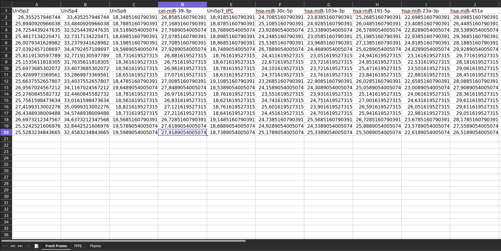
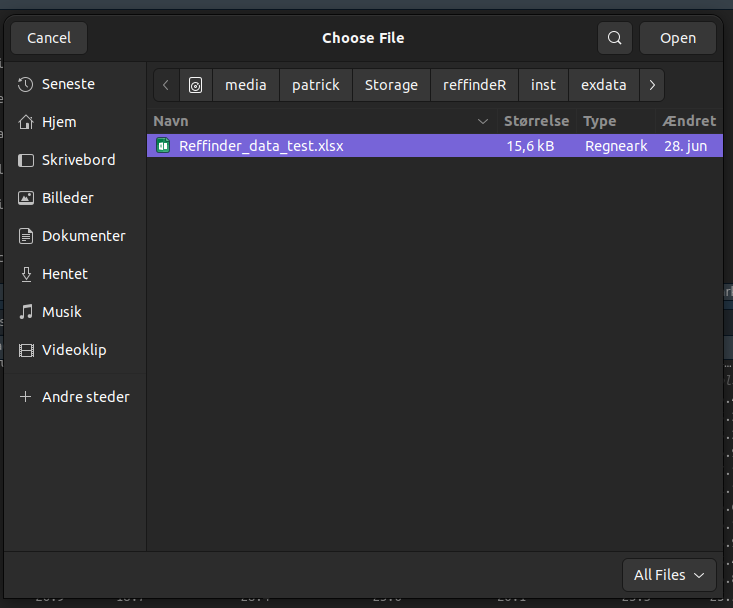

```{r, include = FALSE}
knitr::opts_chunk$set(
  collapse = TRUE,
  comment = "#>"
)
```


This vignette will show you how to prepare and import expression data into R using the refSeeker package.

Data can be imported from several different file types, however, some requirements and limitations will be discussed for each type of file.

Once data has been successfully loaded the stability analysis can be performed. Please refer to the <<INSERT NAME OF ANALYSIS VIGNETTE>> for further help with performing the stability analysis.

```{r setup}
library(refSeeker)
```

## Loading data from spreadsheetes (excel or ODS) or text based (csv, tsv, txt) files.


Behind the scenes separate functions exist for importing from different sources but using the rs_loaddata() will handle the correct function calls based on the file extensions of the selected files.


### Prepare Data

Before loading data from any file first need to be prepared:

Excel and ods files:

- Each sheet must contain only one data set

- Each column must be representing a gene/target and each row representing an individual sample.

- Each column must be named.

- Row names must be excluded.

csv, tsv or txt:

- Each file can only contain one data set.

- Each column must be representing a gene/target and each row representing an individual sample.

- Each column must be named.

- Row names must be excluded.


Note that missing data is discouraged since this has not been tested and verified





To load data one or more files use rsloaddata().


```{r eval=FALSE}
exceldata <- rsloaddata()
```

If no file path is provided, a dialog window will appear, allowing for selecting one or more files.



Excel data can also be loaded via provided file path
```{r }
exceldata <- rs_loaddata("../inst/exdata/vignetteInputs/Reffinder_data_test.xlsx")

exceldata
```


The result returned from a successful loading of data is a list containing the data sets loaded from each sheet.

Each individual data set can be selected using the list index or name.

```{r eval=FALSE}
exceldata$Fresh_Frozen
```
or
```{r}
exceldata[[1]]
```


## Loading data from csv, tsv or txt files

# Prepare data

To prepare data for import using text file based files it is recommended to create a separate folder to hold the data files.

When loading data the load function will look for all the files of the same type in the folder containing the selected/provided file. This means that if a csv file is selected for import the function will try to import all csv files in that folder. This could lead to unwanted results if the wrong csv file is imported alongside the correct ones.


<br>
<br>
<br>
<br>
<br>
<br>
<br>
<br>
<br>
<br>
<br>
<br>


