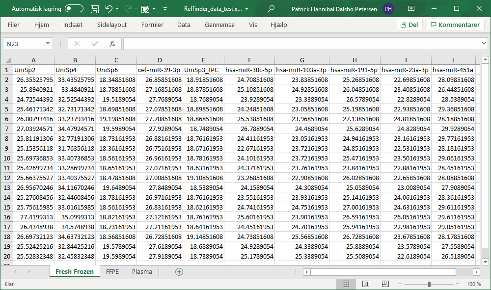

```{r, include = FALSE}
knitr::opts_chunk$set(
  collapse = TRUE,
  comment = "#>"
)
```


This vignette will show you how to prepare and import expression data into R using the RefSeeker package.

Data can be imported from several different file types, however, some requirements and limitations will be discussed for each type of file.

Once data has been successfully loaded the stability analysis can be performed. Please refer to the Stability Analysis for further help with performing the stability analysis.

```{r setup}
library(RefSeeker)
```

## Loading data from spreadsheetes (excel or ODS) or text based (csv, tsv, txt) files.


Behind the scenes separate functions exist for importing from different sources but using the rs_loaddata() will handle the correct function calls based on the file extensions of the selected files.


### Prepare Data

Before loading data from any file, first the files need to be prepared:

Excel and ods files:

- Each sheet must contain only one data set

- Each column must be representing a gene/target and each row representing an individual sample.

- Each column must be named.

- Row names must be excluded.

csv, tsv or txt:

- Each file can only contain one data set.

- Each column must be representing a gene/target and each row representing an individual sample.

- Each column must be named.

- Row names must be excluded.


Note that missing data is incompatible with the RefSeeker stability calculations and will break the analysis.





To load data one or more files use rs_loaddata().


```{r eval=FALSE}
rs_data <- rs_loaddata()
```

If no file path is provided, a dialog window will appear, allowing for selecting one or more files.


Data can also be loaded via provided file path
```{r }
rs_data <- rs_loaddata("../inst/exdata/vignetteInputs/RefSeeker_data_test.xlsx")

rs_data
```
If more files need to be loaded simultaneously these need to present in the same folder to allow for selection of the multiple files.

An alternative is to provide the function with a character vector containing the paths to the desired data sets.

```{r eval=FALSE}
rs_data <- rs_loaddata(c("/path/to/file1", "/another/path/to/file2"))
```

Different file types can be loaded simultaneously so mixing csv and xlsx file is not a problem. If the names of the data sets are the same this will be handled by adding a numeric identifier to the name.

Data set names are derived from the sheetnames of spreadsheet data and from the filename of text based data.

The result returned from a successful loading of data is a list containing the data sets loaded from each sheet.

Each individual data set can be selected using the list index or name.

```{r eval=FALSE}
rs_data$Fresh_Frozen
```
or
```{r}
rs_data[[1]]
```
<br>
<br>
<br>
<br>
<br>
<br>
<br>
<br>
<br>
<br>
<br>
<br>


