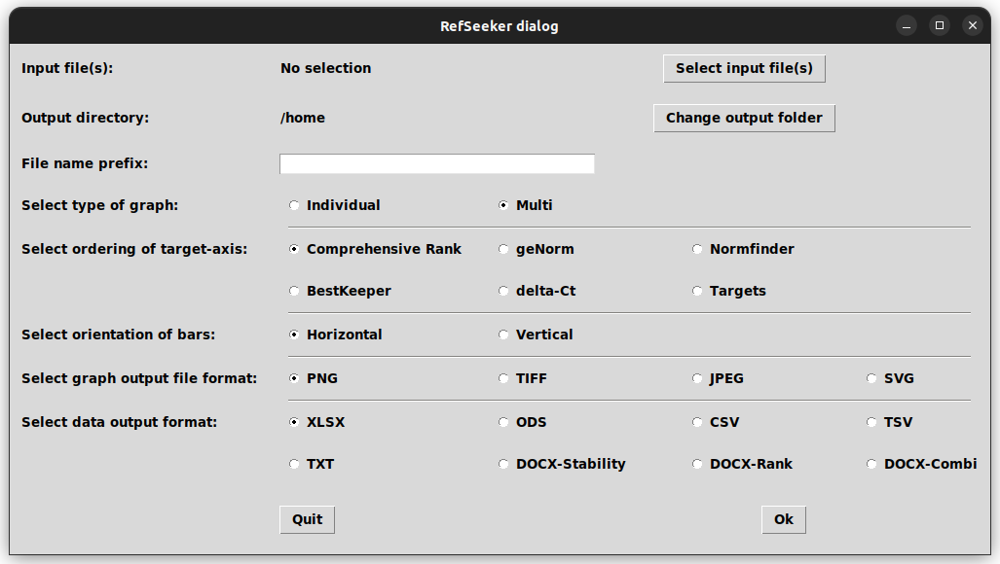

```{r, include = FALSE}
knitr::opts_chunk$set(
  collapse = TRUE,
  comment = "#>"
)
```


The RefSeeker package provides a convenient way of analyzing target stabilities from raw Cp/Ct/Cq values expression data of set of samples.
It uses the RefFinder method which includes a stabilities calculated by four different algorithms: Normfinder, geNorm, bestKeeper and delta-Ct.
The target stabilities are then ranked and a geometric mean of the ranking from each algorithm is then calculated as the comprehensive ranking.

The package include functions for easy import of raw data, extraction of stability values for each algorithm and an easy way of exporting these data either for further use. Either in the form of excel files or as csv files.

After installation the library is loaded as all other packages.

```{r setup}
library(RefSeeker)
```


The function contained in the RefSeeker package has all been given the prefix "rs". Function that are meant to be used by user has the prefix "rs_".
The "rs" without the underscore are mostly helpers for the other functions.


## Data input requirements

Input data can be prepared in a number of ways. The data do not need to be imported if the preparation is handled in R. In this case data should be prepared in the form of matrices, data frames or a tibbles.

Input data can also be provided in the form of the following supported file types; xlsx, xls, ods, csv, tsc, txt.

More than one file can be selected for comparison or as individual parallel analyses.


No matter the input source, the following requirements are the same:

- Each column must be representing a gene/target and each row representing an individual sample.

- Each column must be named.

- Row names must be excluded

- No missing data is allowed¨k


### Load data from file

Data can be loaded using the rs_loaddata function, a file selection dialog will appear if a file path is not provided, please see the "Loading data sources" vignette for further information.


## Analysing a single expreiment

A randomly generated example can be seen below:

```{r data example 1}
set.seed(100)
ct_vals <- matrix(rnorm(5*20, mean = 25), ncol = 5, nrow = 20)
dimnames(ct_vals)[[2]] <-  c("gene1", "gene2", "gene3", "gene4", "gene5")
ct_vals
```

To obtain the RefSeeker results run:

```{r}
rs_results <- rs_reffinder(ct_vals)
rs_results
```

This produces a list of two tables. A table containing target stability values for each algorithm and a ranking table that ranks the most stable from 1 to N number of targets.


## Table export

To export the table the function rs_exporttable() is available. 

Main arguments are the rs_reffinder results and a table type which can be any of: 

"xlsx", "ods, csv", "tsv", "txt", "docx-stability", "docx-rank" or "docx-combi".

Depending on the selected table type one or files per data set is created. Please see the "Export stability results" vignettes for further information. 
<br>
Two examples of the rs_exporttable() can be seen below.
<br>
<br>
To create an excel file containing the tables:
```{r eval=FALSE}
rs_exporttable(rs_results, "./output/folder/sample_excel_tables", tabletype = "xlsx")
```

The two tables will appear in the excel file as separate sheets with filter options.

<br>
To create a formatted table in a docx file:
```{r eval=FALSE}
rs_exporttable(rs_results, "./output/folder/sample_docx-combi_table", tabletype = "docx-combi")
```

A docx document with the formatted table has now been created given path.


## Creating a graph

For a graphical representation rs_graph() can be used. This has several available tweaks to control output including file types, orientation of bars and the option for adding specific colors to specific targets. Please see the "Export stability graphs" vignette for further information.
For a nice visualization of the stabilities, use:

```{r refSeeker-intro_fig, fig.asp = 0.3, fig.height = 4, fig.width = 9, out.width="99%", fig.align='center'}
rs_graph(rs_results)

```


To print the graph as a Png file, just add a file name and select a file type.

File types can be any of: "png", "tiff", "jpeg" or "svg".

```{r eval=FALSE}
rs_graph(rs_results, "./output/folder/Sample stability", filetype = "png")
```


Et voilà! Now you can select the targets with the lowest stability value as reference genes for your expression studies


## The Wizard

To perform a quick and guided analysis, there is one function to rule them all: the rs_wizard()

By running this, a dialog will appear (note: It has been observed that on windows machines, the dialog window are not always sent to the foreground and may hide underneath other open windows).

The rs_wizard dialog will provide a simple an easy interface for selecting input files, output directory, file name prefix, graph type, ordering of the targets on the target axis, orientation of the bars, graph output format and table output format.

Note that some functionalities are limited. It is so far only possible to import from data files and options like color and parameters like dimension of the graph can not be adjusted yet.

```{r eval=FALSE}
rs_wizard()
```
{width=100%} 
 

<br>
<br>
<br>
<br>
<br>
<br>


