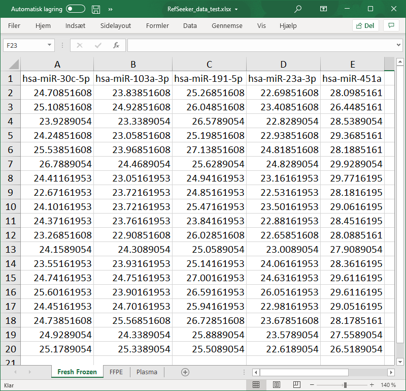
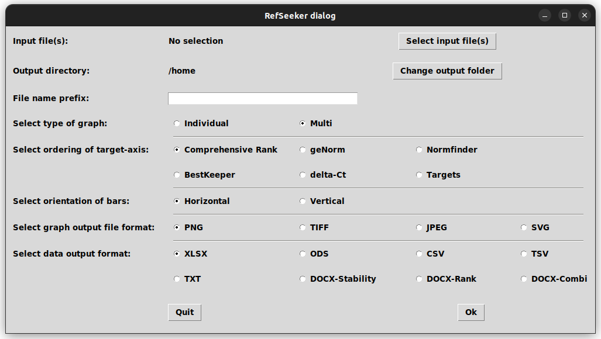
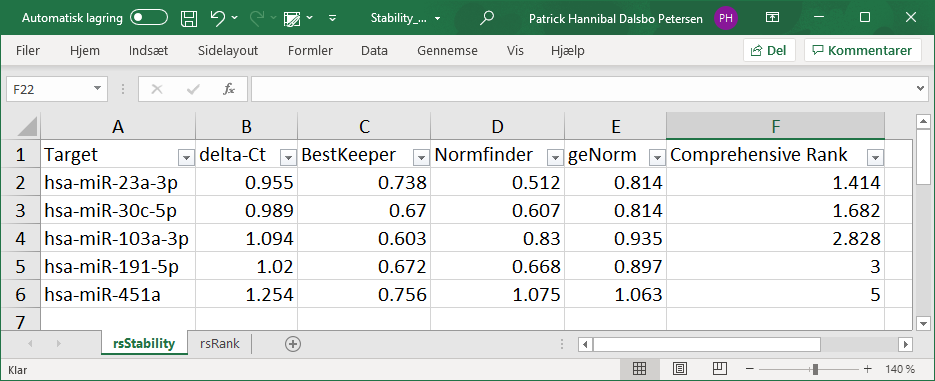
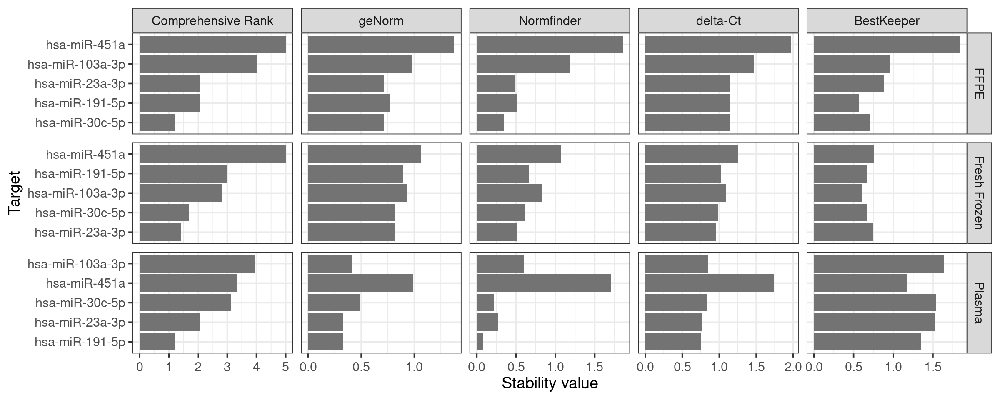
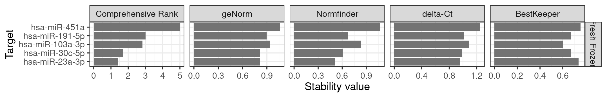
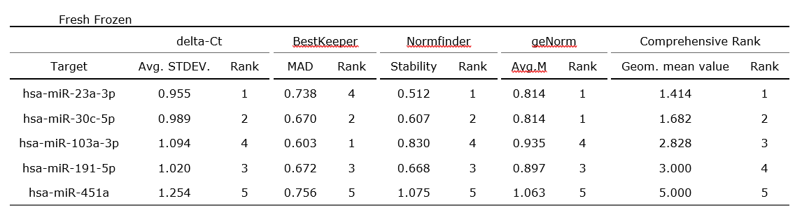
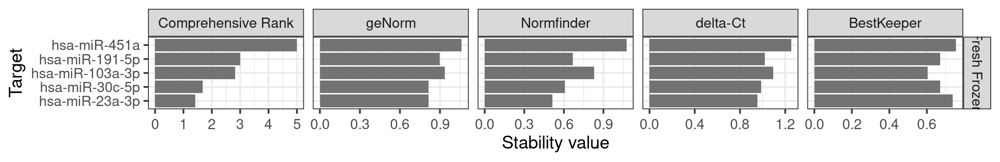
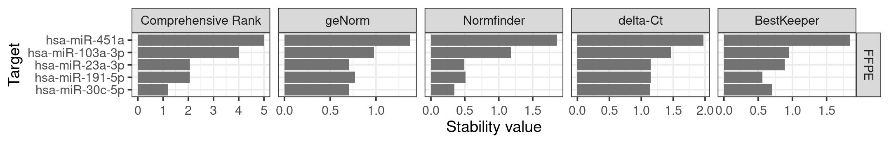
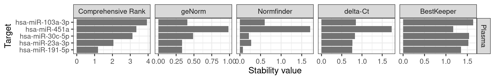

```{r, include = FALSE}
knitr::opts_chunk$set(
  collapse = TRUE,
  comment = "#>"
)
```

```{r setup}
library(RefSeeker)
```


In this vignette we will explore how to perform stability analysis by the RefFinder method[@Xie2012a]. In doing so, stability will be calculated using the four different algorithms; delta Ct[@Silver2006], geNorm[@Vandesompele2002a], BestKeeper[@Pfaffl2004]  and Normfinder[@Andersen2004]. These stabilties will be ranked for each algorithm and a geometric mean of these ranks is used to arrive at Comprehensive Rank for each target/gene/miRNA.


### Prepare Data

The input data need to be formatted correctly. See the "Loading_data_sources" vignette for further info on other file types.

Here we will just give quick example:

Before loading data from excel, the file first need to be prepared:

- Each sheet must contain only one data set

- Each column must be representing a gene/target and each row representing an individual sample.

- Each column must be named.

- Row names must be excluded

Note that missing data is not allowed and will brake some functions.




## Quick and easy analysis

If all is needed is a quick answer on what is most stable, the easiest is to use the interactive rs_batch functions. For example:

```{r eval = FALSE}
rs_wizard()
```
This will first bring up a dialog to choose the location of the input data. Then an output folder and finally the type og graph that is wanted.

{width=90% align="center"}
<br>
<br>Single graph means one graph per data set, if the input data consist of only one data set it does not matter what is selected, they will give the same output.
If more data sets are in the inout data a multigraph will print them all side by side for comparison.

Keep in mind that by default, the x-axis is arranged using the RefFinder Comprehensive  Rank stabilities, meaning that the sequence of targets on the x-axis will be arranged from most to least stable and might not be in the same order even in a multigraph, this behavior can be changed selecting a different ordering in the dialog. To keep the same arrangements on all graphs "Targets" can be selected. This will arrange the targets based on the appearance in the imported data set.


The output consist of an excel file for each data set containing two sheets, one with stabilty values and another with stabilty rankings together either a single multihgraph or single graphs for each data set.


{width=100%} 
{width=100%}
{width=100%}
<br> 
From This figure it is clear that not all algorithms agree on the stability ranging. As a user you can rely on the results of a selected algorithm of choice. In this case we could use the Comprehensive Rank since it take them all into account.
According to this, the two most stable miRNAs is hsa-miR-23a-3p and hsa-miR-30c-5p. These could then be used as reference genes for normalization of the expression data.

<br>A formatted table can be output to a docx document. Selecting the "DOCX-Combi" will result in following table
<br>

{width=100%} 


## Manual analysis

To perform a manual or automatic analysis the easiest is to load in the data as described in the Loading_data_sources vignette and then 


```{r}

inputData <- rs_loaddata("../inst/exdata/vignetteInputs/RefSeeker_data_vignetteSample.xlsx")
```

The data can now be analysed by each algorithm or RefFinder Comprehensive Rank

```{r}
rs_normfinder(inputData$Fresh_Frozen)
```

```{r}
rs_genorm(inputData$Fresh_Frozen)
```

```{r}
rs_bestkeeper(inputData$Fresh_Frozen)
```

```{r}
rs_deltact(inputData$Fresh_Frozen)
```

Using rs_reffinder() provides the option of calculating all data sets in one line. The function returns a list-of-lists of two tables for each set.

```{r}
rsresults <- rs_reffinder(inputData)
rsresults

```

As can be seen on the output two table are created from each data set.

- A stability table containing the stability values provided by each algorithm and RefFinder.

- A rank table containing the ranking of each gene/target from each algorithm.

From here the results can be exported to new excel files, one excel file per data set will be created

```{r eval = FALSE}
rs_exporttable(rsresults$Fresh_Frozen, "../inst/exdata/VignettesOutputs/excel_results", tabletype = "xlsx", addDate = TRUE)

```


To create graphical representations of the data the rs_graph() function can be used.

```{r fig.asp = 1, fig.width = 9, out.width="99%", fig.align='center'}

rs_graph(rsresults)

```

To create graph for each of the data sets use the forceSingle switch.
To create a png file containing the graph, a file name must be provided. This may contain an absolute or relative path to direct the output to a selected location.
The height and width of the graphs can be controlled by the arguments to rs_graph(): height and width 
Also note that the file name provided will be used as a base name such that sub files will inherent the base and sub names is added as well as file extensions. 
```{r eval = FALSE}

rs_graph(rsresults, "../inst/exdata/VignettesOutputs/refSeeker_excel_results", forceSingle = TRUE)

```

{width=90%} {width=90%} {width=90%}
<br>
<br>
<br>
<br>
<br>
<br>
